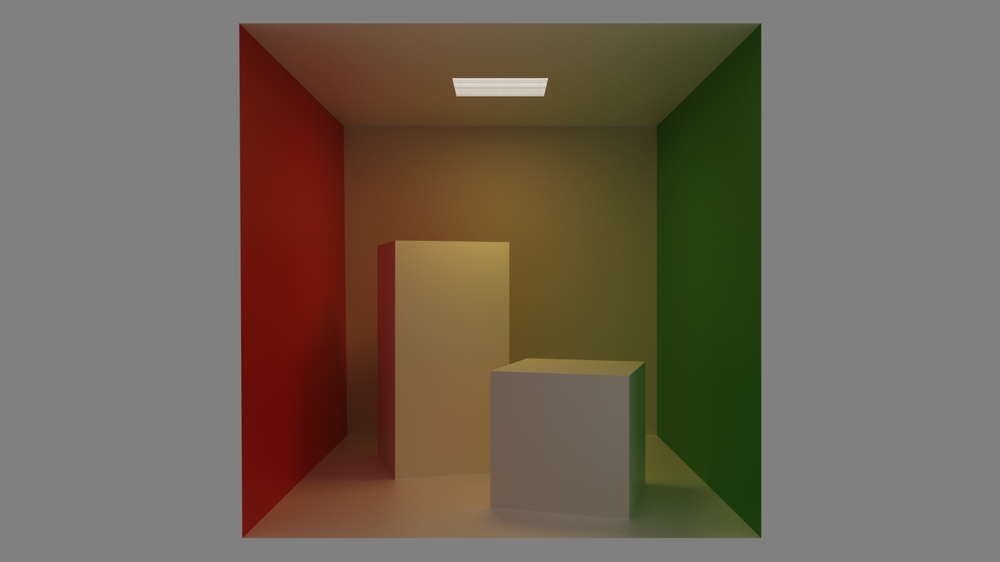
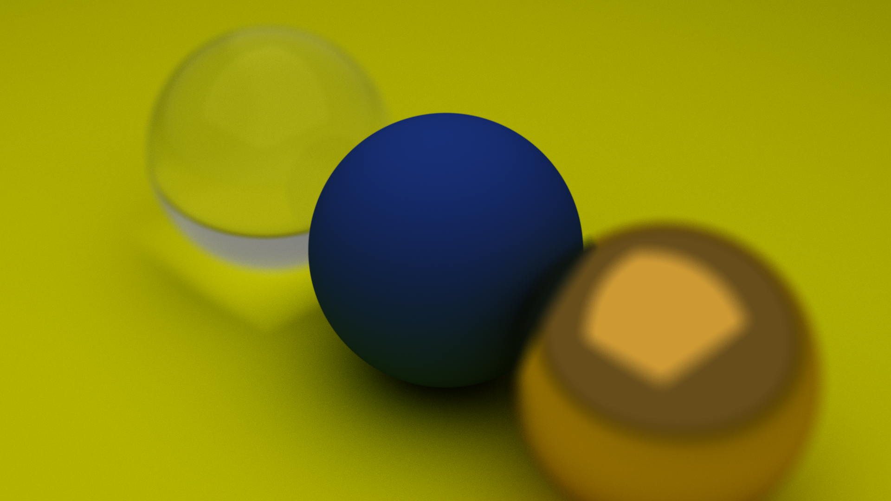
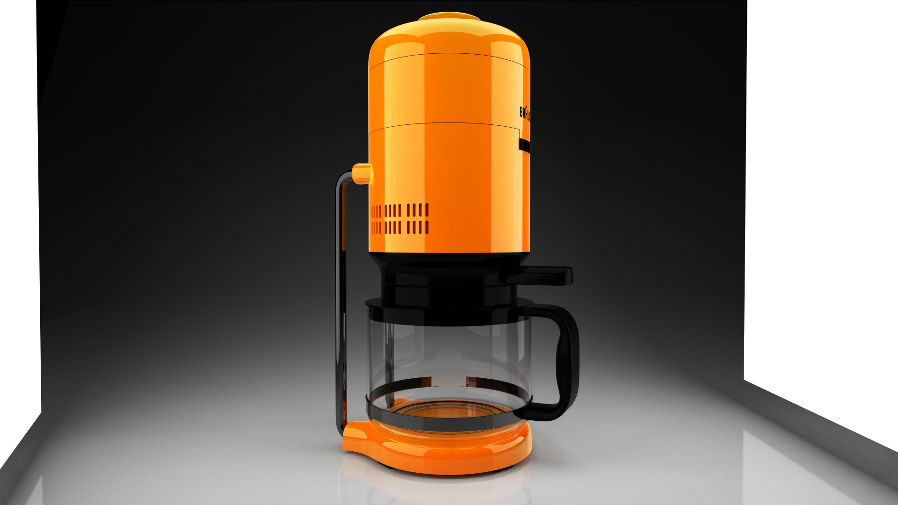
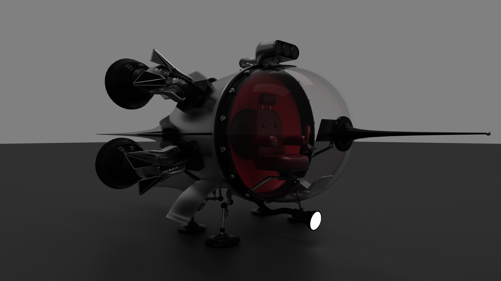
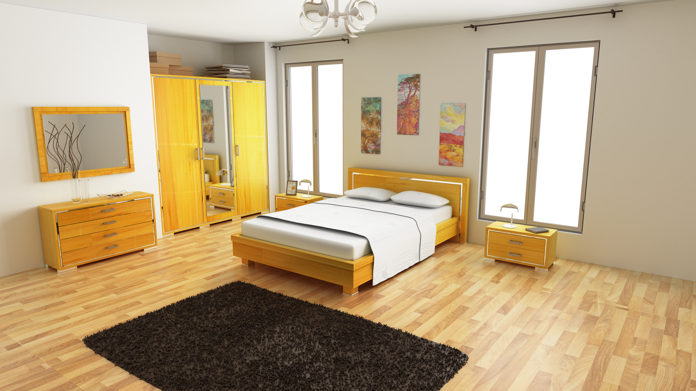
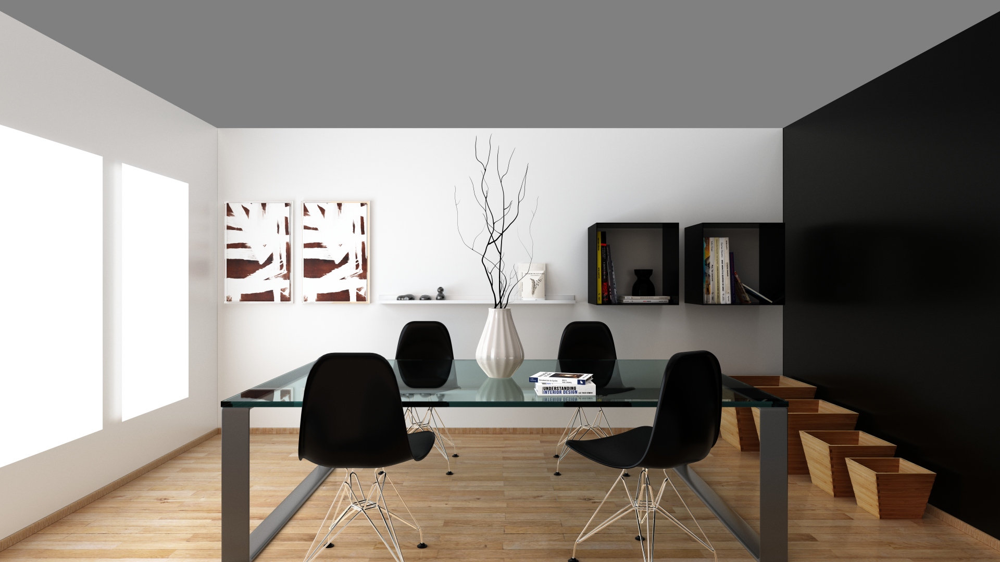
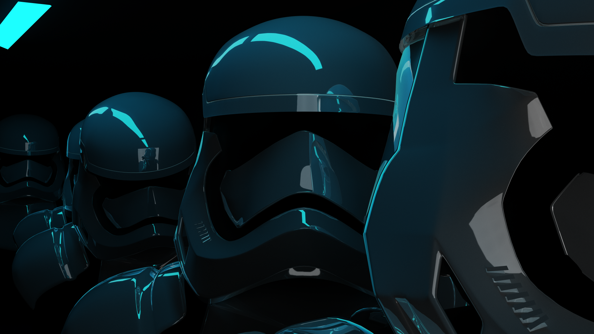
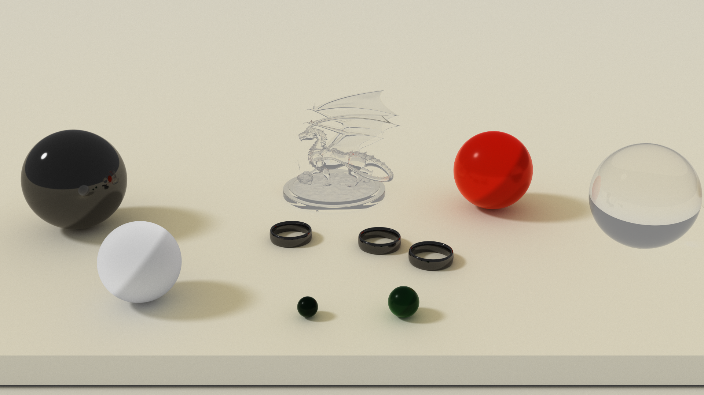
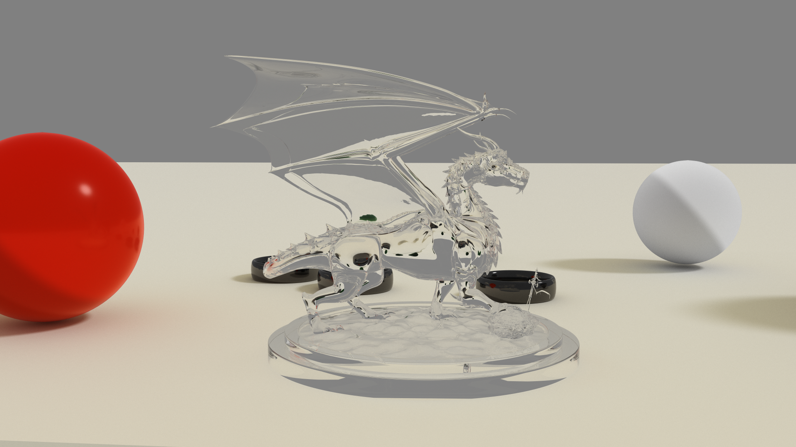

# MinimalOptiX

MinimalOptiX is a simple path tracing rendered based on [OptiX](https://developer.nvidia.com/optix). I don't expect anyone to really use this project, but I hope it can help beginners to get familiar with OptiX.

## Demos

### Cornell Box

### Spheres - Pinhole Camera

### Spheres - Lens Camera

### Random Spheres

We also have a video [here](https://youtu.be/LYERSPoh_GA).

### Coffee Pot

### Spaceship

### Bedroom

### Dining Room

### Stormtrooper

### Hyperion

## Features

### Geometry and Scene

MinimalOptiX supports sphere, quadrangle, and triangle mesh. It can load scene description from file dynamically.

### Material

MinimalOptiX supports three basic materials: Lambertian, metal and glass. It also implements [Disney BRDF](https://disney-animation.s3.amazonaws.com/library/s2012_pbs_disney_brdf_notes_v2.pdf).

## Credits

* BRDF evaluation comes from [here](https://github.com/wdas/brdf/blob/master/src/brdfs/disney.brdf).
* Sampling, PDF and scenes come from [Optix-PathTracer](https://github.com/knightcrawler25/Optix-PathTracer). Well, his results are better than mine.
* .obj file loader comes from [TinyObjLoader](https://github.com/syoyo/tinyobjloader).
